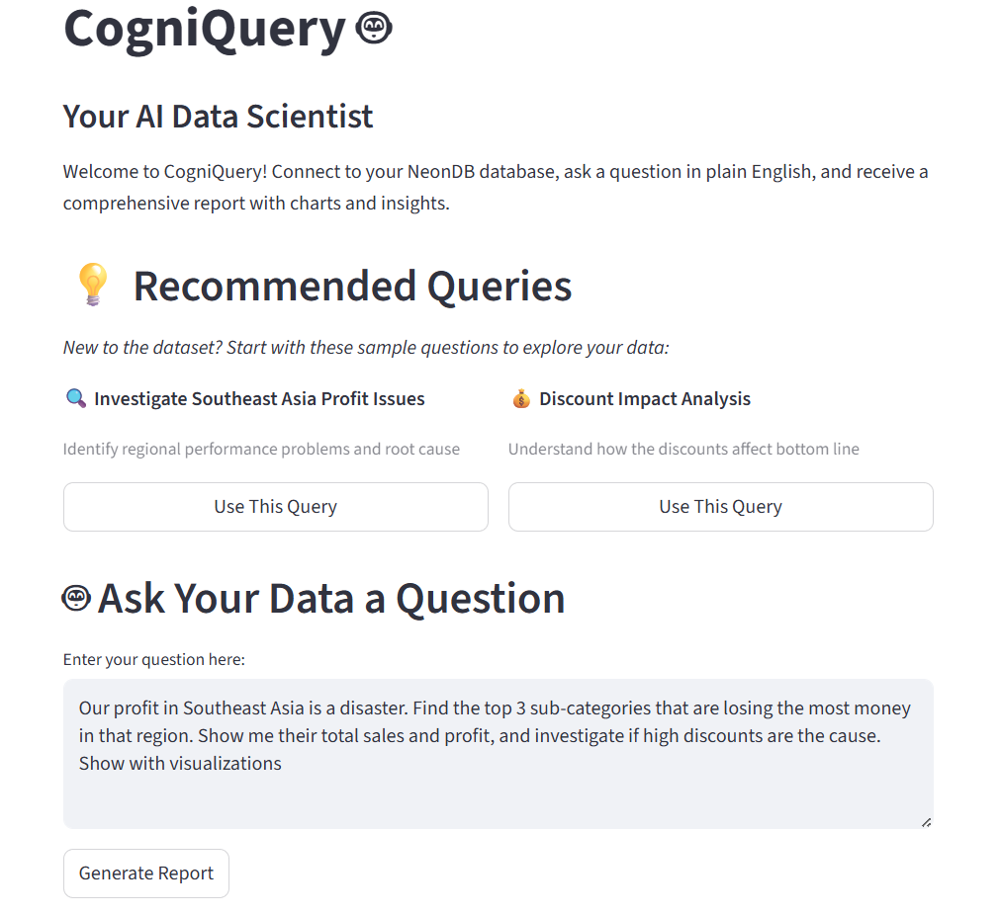
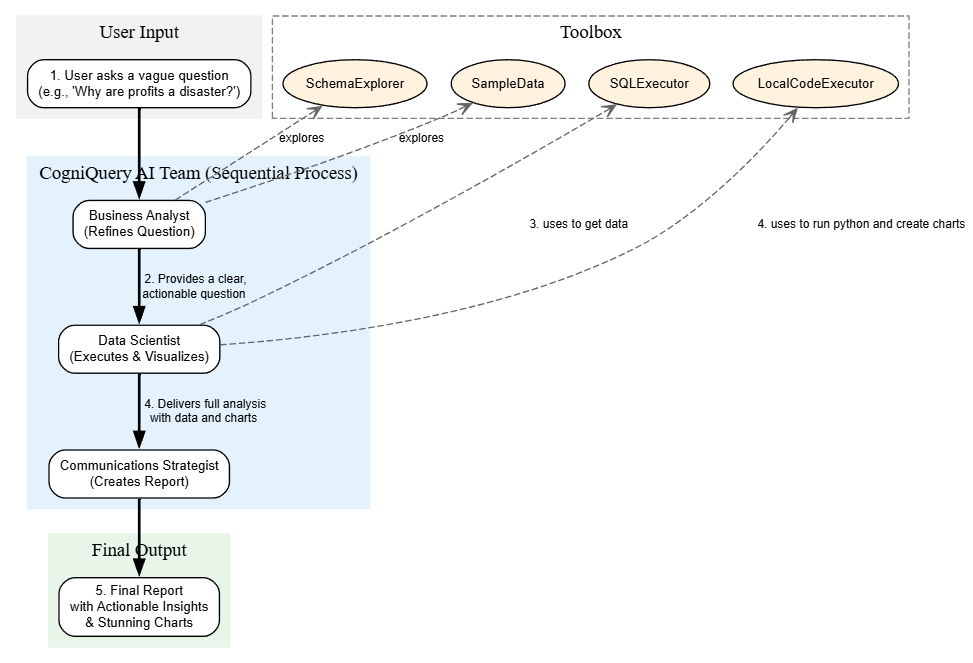
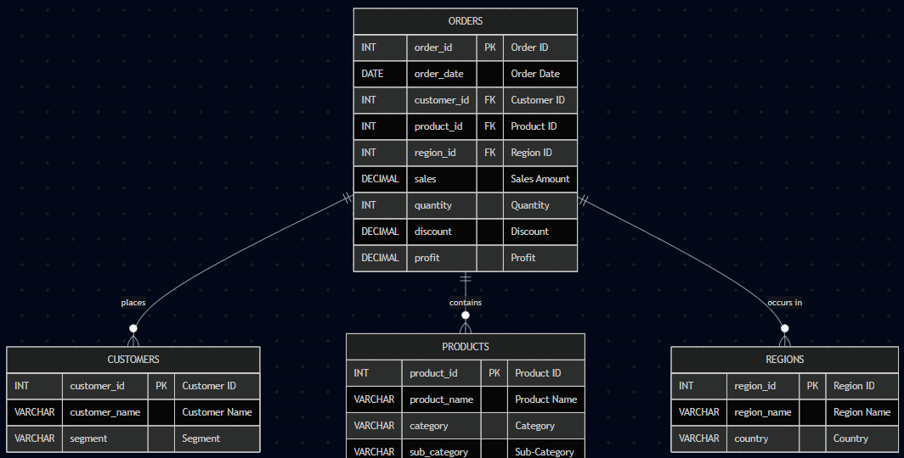

# CogniQuery: The AI Data Team in a Box
*Submission for FutureHack! A.I. Battlefield 2025*

Hi everyone! We’re the builders of CogniQuery.

### **tl;dr**

We're building an AI that lets anyone talk to their database. Business teams, marketers, and execs use CogniQuery to get from complex questions to visual reports in seconds, without writing a single line of SQL.
**🎥 Demo Video:**  
[Watch the CogniQuery demo (MP4, 2 min)](https://www.youtube.com/watch?v=myaHQKg91fw)

See how CogniQuery turns questions into insights—no SQL required!

---

### **Ask**

1.  **Try CogniQuery:** Watch our video demo to see it in action.
2.  **Connect us:** If you know a team drowning in data but starved for insights, please introduce us!

---

### **Problem**

Your company’s data is a goldmine, but it’s locked in a vault that only engineers can open. Business users have urgent questions, but getting answers means filing a ticket and waiting days, if not weeks.

This slow, frustrating loop costs companies millions in missed opportunities and slow decision-making. Standard "Text-to-SQL" tools often fail because they don't understand business context, leading to wrong queries and useless results.

*Business questions get lost in translation.*

---

### **Solution**

CogniQuery is a desktop app that gives every employee an on-demand AI data analytics team.

*   **Understands Your Questions:** Go beyond simple keywords. CogniQuery's AI Analyst clarifies ambiguous requests and explores your database schema to understand the real question you're asking.
*   **Writes Code & Builds Charts:** An AI Data Scientist writes the necessary SQL, runs it, and then immediately uses Python to generate stunning, insightful charts.
*   **Delivers a Full Report:** An AI Strategist compiles everything into a clear, executive-ready summary, explaining *what* the data means and *why* it matters.

Our key feature is the **Live Agent Activity Log**, which lets you watch the AI team collaborate in real-time. This builds trust and transparency, showing you exactly how your answer was derived.

---

### **Our Architecture: A Collaborative AI Team**

CogniQuery isn't just one model; it's a crew of specialized AI agents powered by CrewAI. This mimics the workflow of a real-world analytics department, ensuring higher quality and more reliable insights.

---

### **Database Schema (ERD)**

Our demo uses a standard e-commerce dataset with interconnected tables for orders, products, customers, and regions.

---

### **How To Run It**

1.  **Clone the repo:** `git clone https://github.com/your-username/your-repo-name.git`
2.  **Set up the environment:** `python -m venv .venv && source .venv/bin/activate`
3.  **Install dependencies:** `pip install -r requirements.txt`
4.  **Set up secrets:** Copy `.env.example` to `.env` and add your keys.
5.  **Load the dataset:** Run the `scripts/setup_dataset.py` script to populate your database.
6.  **Launch the app:** `streamlit run app.py`

---
### **About Us**

We're a team of builders who believe that the best AI doesn't just answer questions—it empowers people to ask better ones. We built CogniQuery over a weekend to prove that complex, agentic AI can solve real-world business problems today.